<h1 align="center">
    SET08103-G11
</h1>

    <em>Group 11's Coursework Submission for SET08103</em>

    
    
    

## Build Status
| Master                                                                                                                                                                                                                                        |                                                                                                                     Develop                                                                                                                     |
|:----------------------------------------------------------------------------------------------------------------------------------------------------------------------------------------------------------------------------------------------|:-----------------------------------------------------------------------------------------------------------------------------------------------------------------------------------------------------------------------------------------------:|
|  |  |

## Query Results
#### 32/32 Reports Complete
| ID  | Report                                                                                                                                                           | Met |                 Output                  |
|:---:|:-----------------------------------------------------------------------------------------------------------------------------------------------------------------|:---:|:---------------------------------------:|
|  1  | [All the countries in the world organised by largest population to smallest](https://github.com/scottlangmead/SET08103-G11/issues/1)                             | Yes |  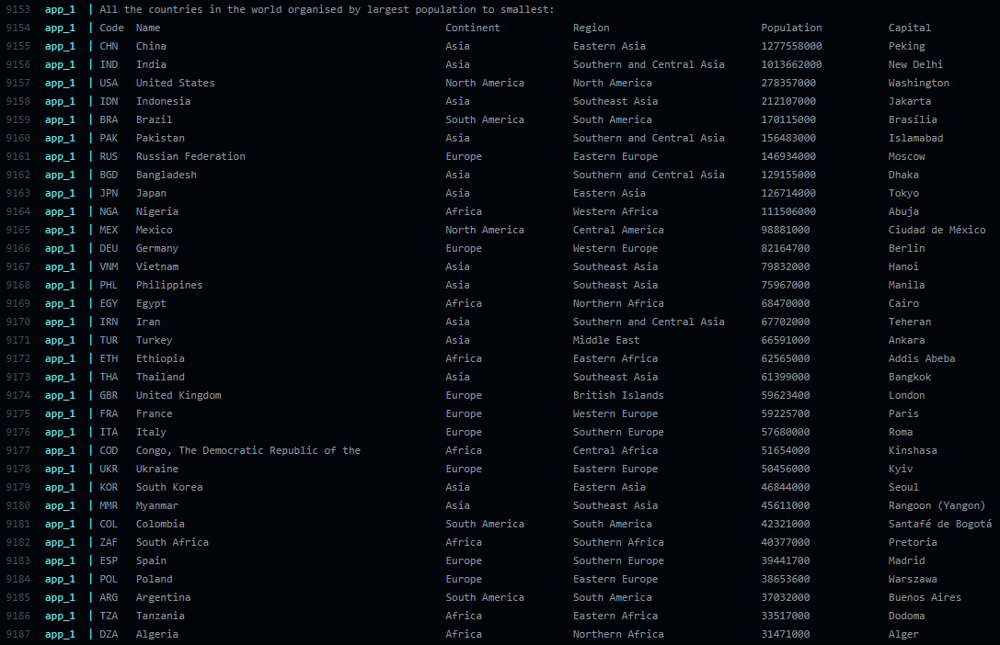  |
|  2  | [All the countries in a continent organised by largest population to smallest (Asia)](https://github.com/scottlangmead/SET08103-G11/issues/2)                    | Yes |  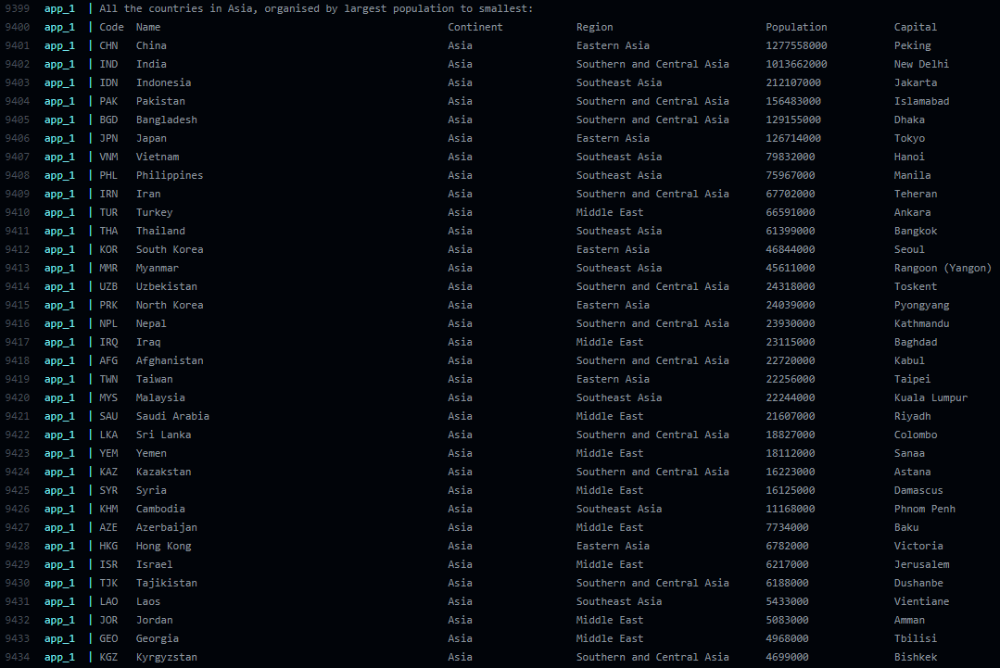  |
|  3  | [All the countries in a region organised by largest population to smallest (Caribbean)](https://github.com/scottlangmead/SET08103-G11/issues/3)                  | Yes |  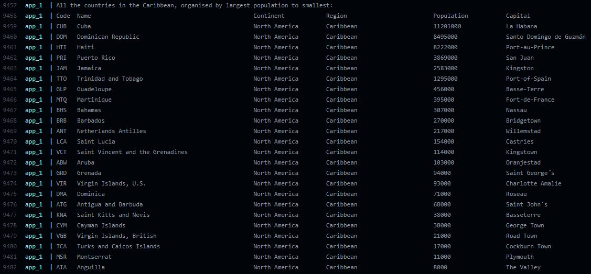  |
|  4  | [The top N populated countries in the world where N is provided by the user](https://github.com/scottlangmead/SET08103-G11/issues/4)                             | Yes |  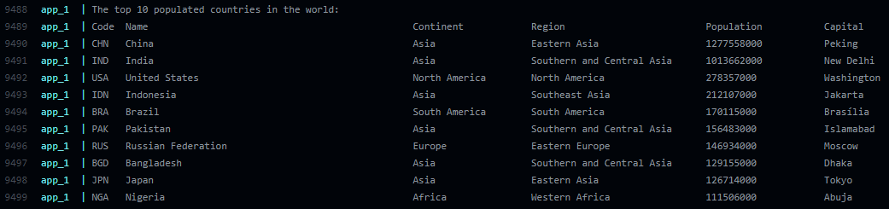  |
|  5  | [The top N populated countries in a continent where N is provided by the user (Europe)](https://github.com/scottlangmead/SET08103-G11/issues/5)                  | Yes |  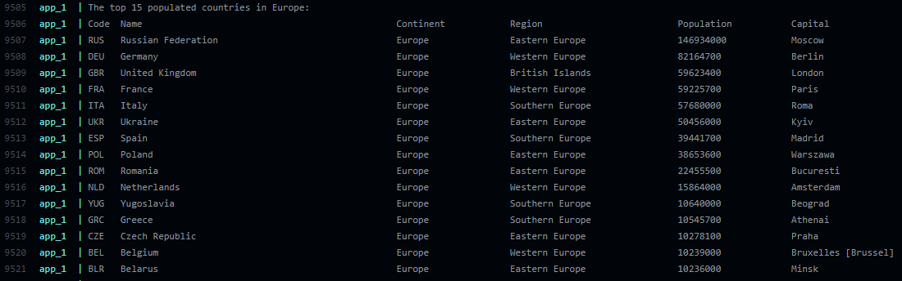  |
|  6  | [The top N populated countries in a region where N is provided by the user (Middle East)](https://github.com/scottlangmead/SET08103-G11/issues/6)                | Yes |  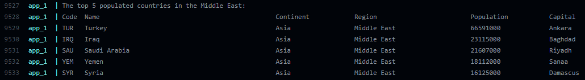  |
|  7  | [All the cities in the world organised by largest population to smallest](https://github.com/scottlangmead/SET08103-G11/issues/7)                                | Yes |  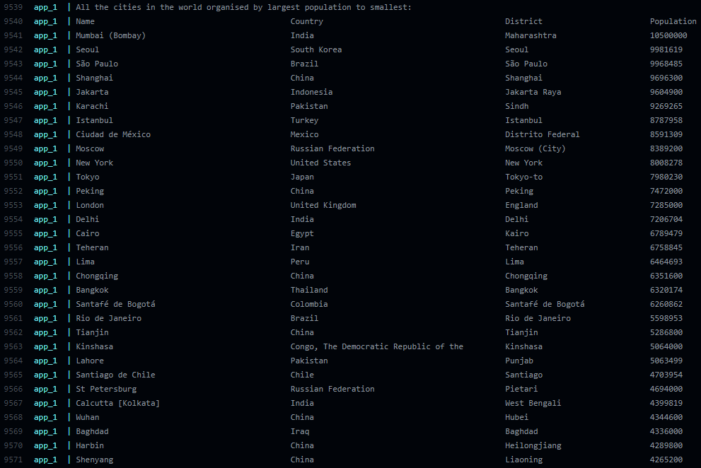  |
|  8  | [All the cities in a continent organised by largest population to smallest (Oceania)](https://github.com/scottlangmead/SET08103-G11/issues/8)                    | Yes |  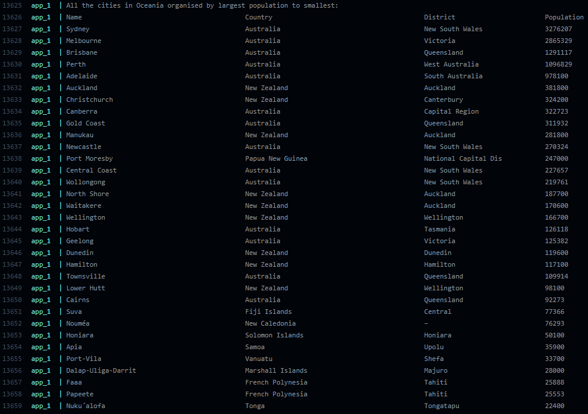  |
|  9  | [All the cities in a region organised by largest population to smallest (Western Europe)](https://github.com/scottlangmead/SET08103-G11/issues/9)                | Yes |  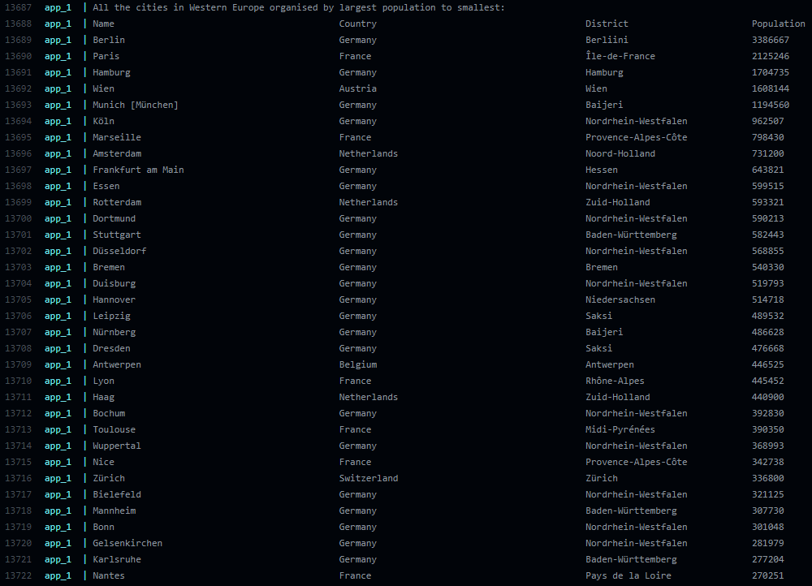  |
| 10  | [All the cities in a country organised by largest population to smallest (United Kingdom)](https://github.com/scottlangmead/SET08103-G11/issues/10)              | Yes | 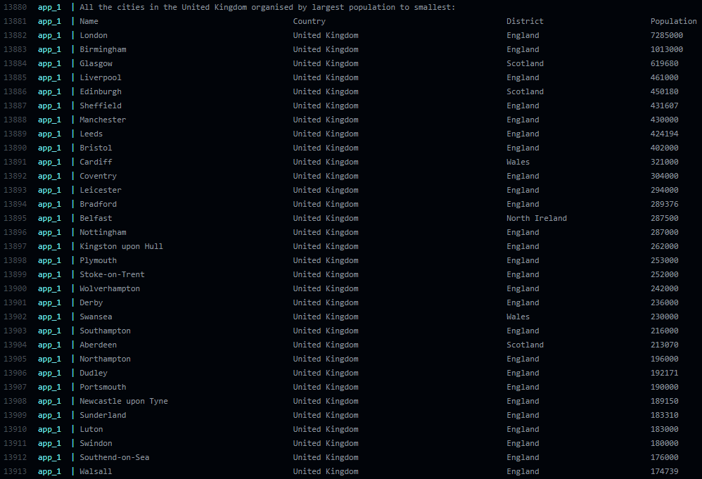 |
| 11  | [All the cities in a district organised by largest population to smallest (Scotland)](https://github.com/scottlangmead/SET08103-G11/issues/11)                   | Yes | 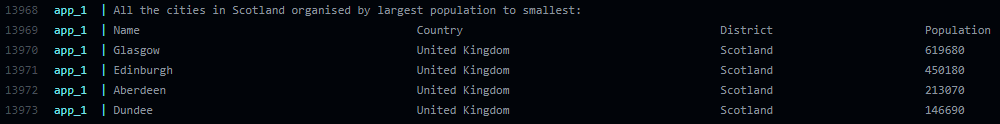 |
| 12  | [The top N populated cities in the world where N is provided by the user](https://github.com/scottlangmead/SET08103-G11/issues/12)                               | Yes | 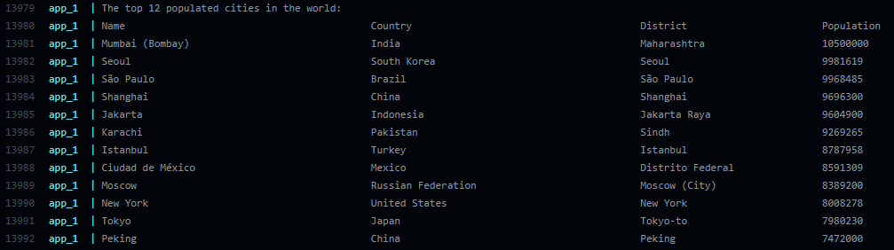 |
| 13  | [The top N populated cities in a continent where N is provided by the user (South America)](https://github.com/scottlangmead/SET08103-G11/issues/13)             | Yes | 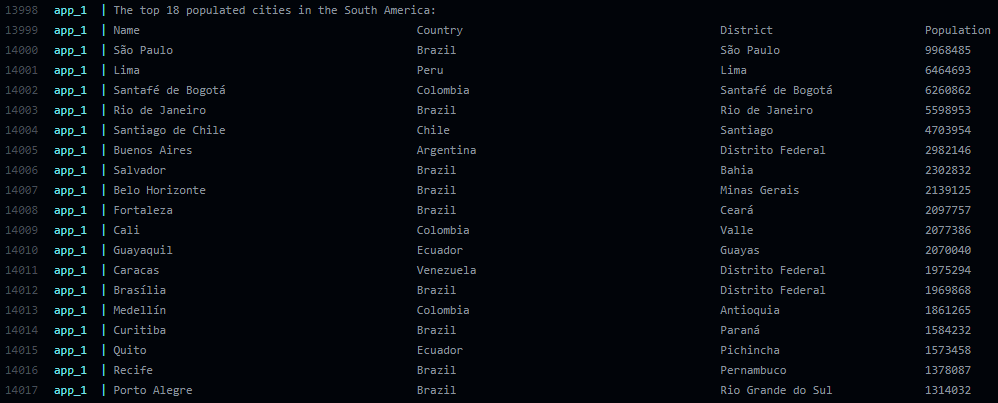 |
| 14  | [The top N populated cities in a region where N is provided by the user (Central Africa)](https://github.com/scottlangmead/SET08103-G11/issues/14)               | Yes | 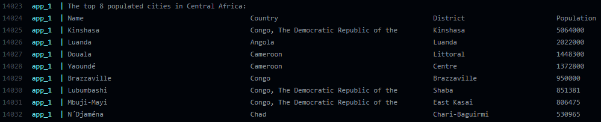 |
| 15  | [The top N populated cities in a country where N is provided by the user (Russian Federation)](https://github.com/scottlangmead/SET08103-G11/issues/15)          | Yes | 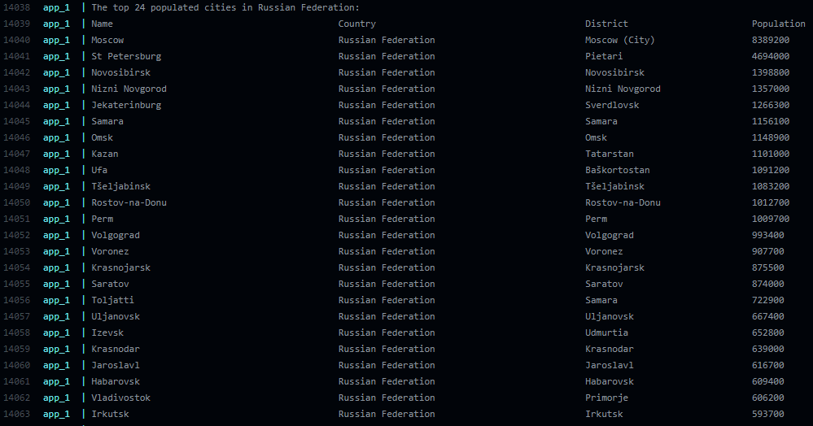 |
| 16  | [The top N populated cities in a district where N is provided by the user (California)](https://github.com/scottlangmead/SET08103-G11/issues/16)                 | Yes | 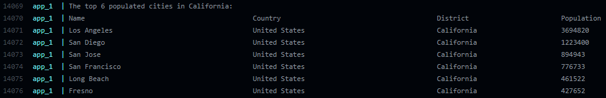 |
| 17  | [All the capital cities in the world organised by largest population to smallest](https://github.com/scottlangmead/SET08103-G11/issues/17)                       | Yes | 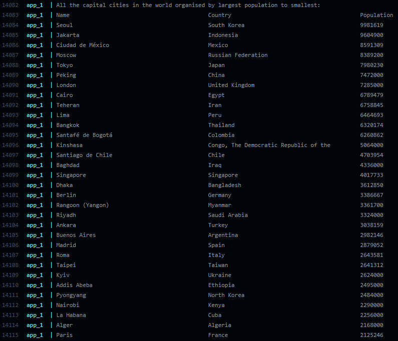 |
| 18  | [All the capital cities in a continent organised by largest population to smallest (Europe)](https://github.com/scottlangmead/SET08103-G11/issues/18)            | Yes | 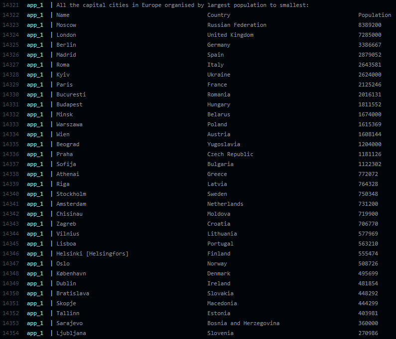 |
| 19  | [All the capital cities in a region organised by largest to smallest (Eastern Europe)](https://github.com/scottlangmead/SET08103-G11/issues/19)                  | Yes | 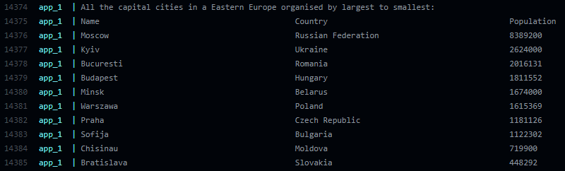 |
| 20  | [The top N populated capital cities in the world where N is provided by the user](https://github.com/scottlangmead/SET08103-G11/issues/20)                       | Yes | 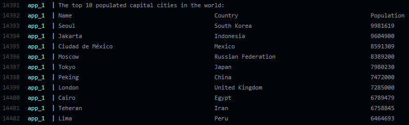 |
| 21  | [The top N populated capital cities in a continent where N is provided by the user (South America)](https://github.com/scottlangmead/SET08103-G11/issues/21)     | Yes | 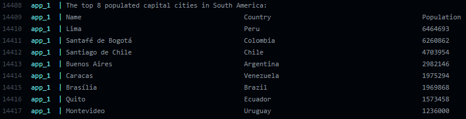 |
| 22  | [The top N populated capital cities in a region where N is provided by the user (Middle East)](https://github.com/scottlangmead/SET08103-G11/issues/22)          | Yes | 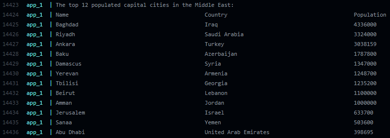 |
| 23  | [The population of people, people living in cities, and people not living in cities in each continent)](https://github.com/scottlangmead/SET08103-G11/issues/23) | Yes | 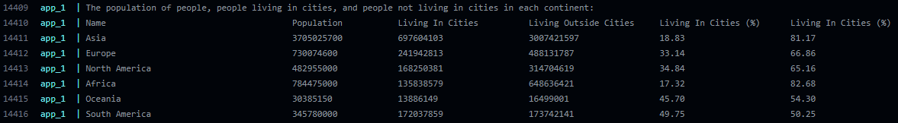 |
| 24  | [The population of people, people living in cities, and people not living in cities in each region)](https://github.com/scottlangmead/SET08103-G11/issues/24)    | Yes | 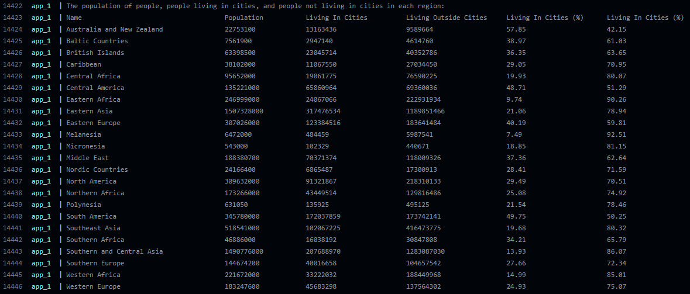 |
| 25  | [The population of people, people living in cities, and people not living in cities in each country)](https://github.com/scottlangmead/SET08103-G11/issues/25)   | Yes | 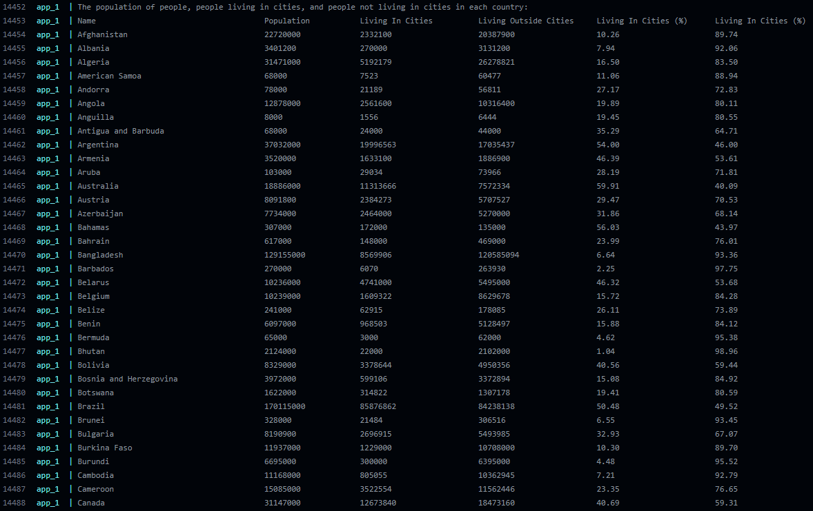 |
| 26  | [The population of the world](https://github.com/scottlangmead/SET08103-G11/issues/27)                                                                           | Yes | 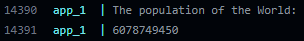 |
| 27  | [The population of a continent (Asia)](https://github.com/scottlangmead/SET08103-G11/issues/28)                                                                  | Yes | 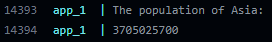 |
| 28  | [The population of a region (Middle East)](https://github.com/scottlangmead/SET08103-G11/issues/29)                                                              | Yes | 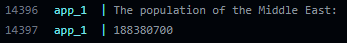 |
| 29  | [The population of a country (Germany)](https://github.com/scottlangmead/SET08103-G11/issues/30)                                                                 | Yes | 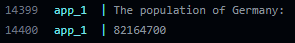 |
| 30  | [The population of a district (Scotland)](https://github.com/scottlangmead/SET08103-G11/issues/31)                                                               | Yes | 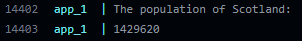 |
| 31  | [The population of a city (London)](https://github.com/scottlangmead/SET08103-G11/issues/32)                                                                     | Yes |  |
| 32  | [Languages of the world](https://github.com/scottlangmead/SET08103-G11/issues/26)                                                                                | Yes | 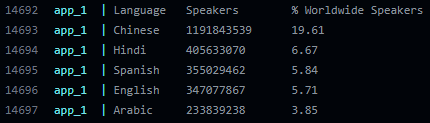 |