# SQL Query Results
| Task                                                                                                                                                         |               Output               |
|:-------------------------------------------------------------------------------------------------------------------------------------------------------------|:----------------------------------:|
| [All the countries in the world organised by largest population to smallest](https://github.com/scottlangmead/SET08103-G11/issues/1)                         |  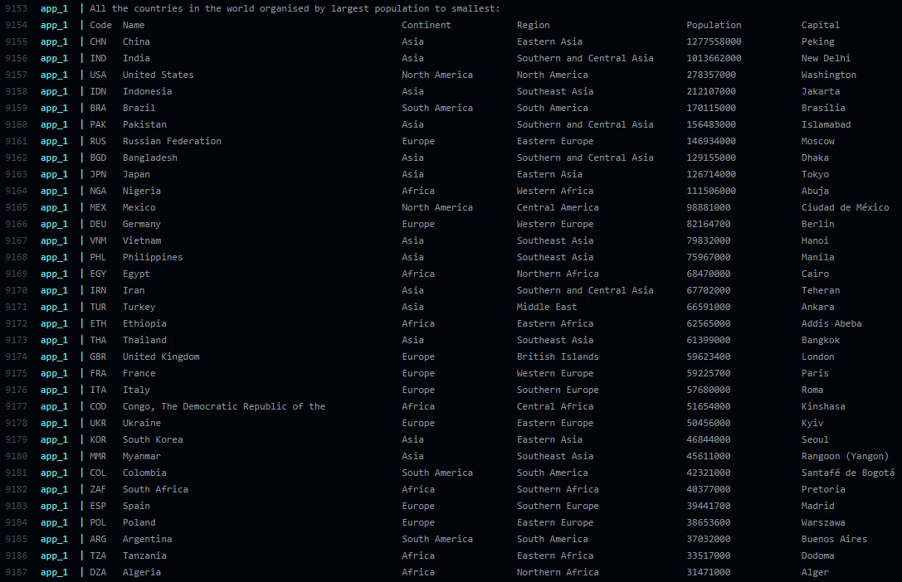  |
| [All the countries in a continent organised by largest population to smallest (Asia)](https://github.com/scottlangmead/SET08103-G11/issues/2)                |  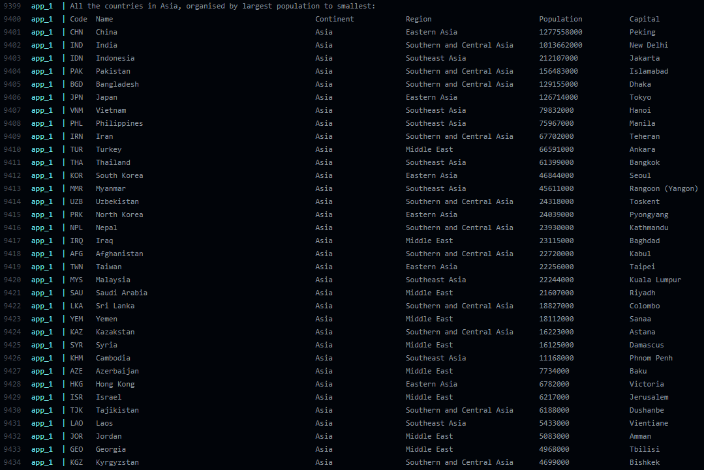  |
| [All the countries in a region organised by largest population to smallest (Caribbean)](https://github.com/scottlangmead/SET08103-G11/issues/3)              |  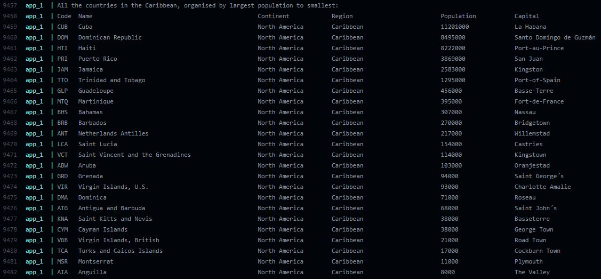  |
| [The top N populated countries in the world where N is provided by the user](https://github.com/scottlangmead/SET08103-G11/issues/4)                         |  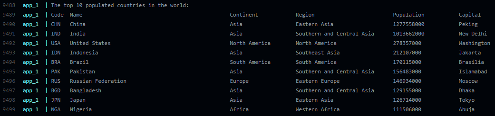  |
| [The top N populated countries in a continent where N is provided by the user (Europe)](https://github.com/scottlangmead/SET08103-G11/issues/5)              |  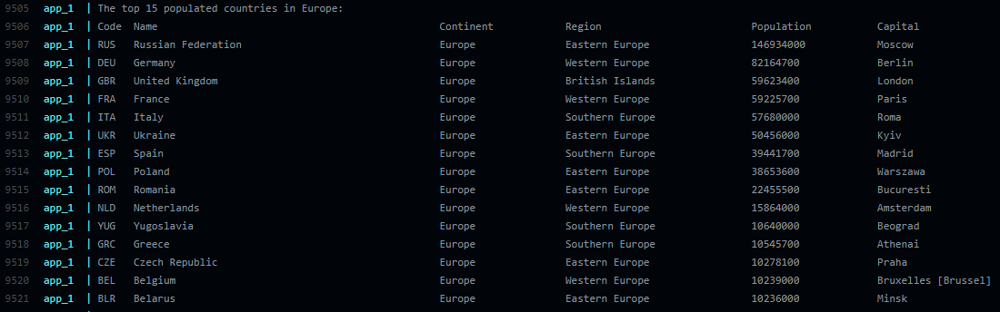  |
| [The top N populated countries in a region where N is provided by the user (Middle East)](https://github.com/scottlangmead/SET08103-G11/issues/6)            |  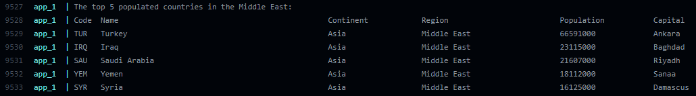  |
| [All the cities in the world organised by largest population to smallest](https://github.com/scottlangmead/SET08103-G11/issues/7)                            |  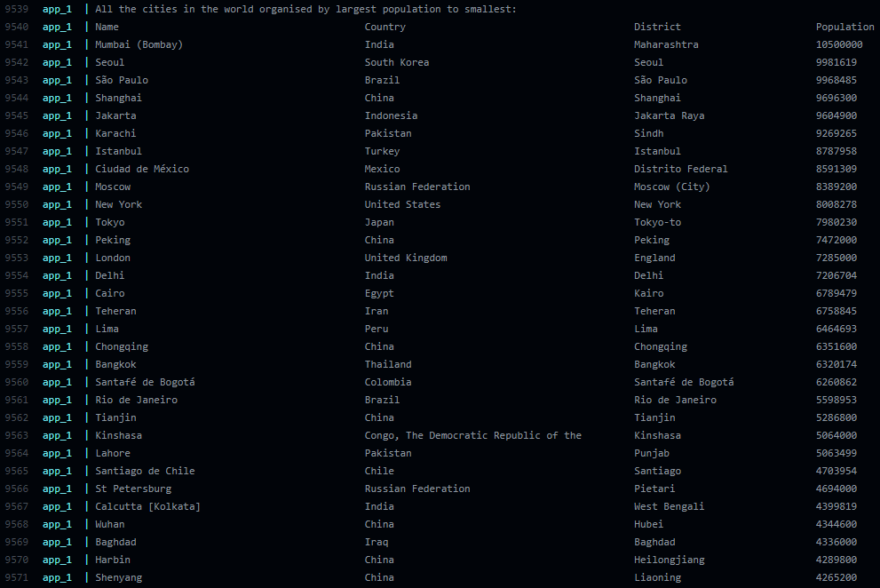  |
| [All the cities in a continent organised by largest population to smallest (Oceania)](https://github.com/scottlangmead/SET08103-G11/issues/8)                |  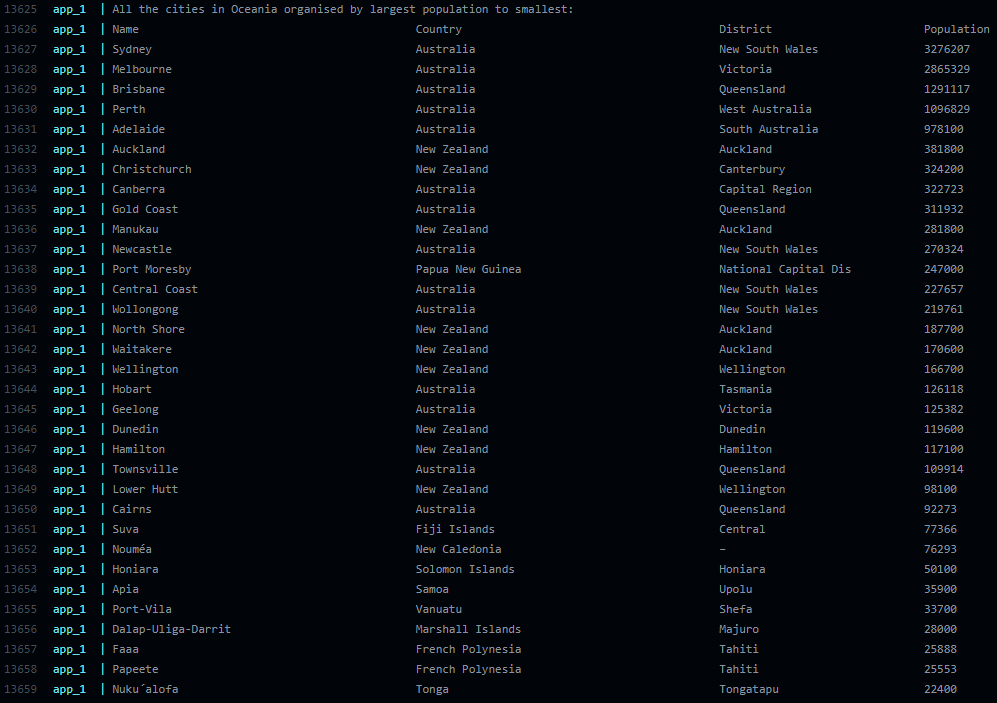  |
| [All the cities in a region organised by largest population to smallest (Western Europe)](https://github.com/scottlangmead/SET08103-G11/issues/9)            |  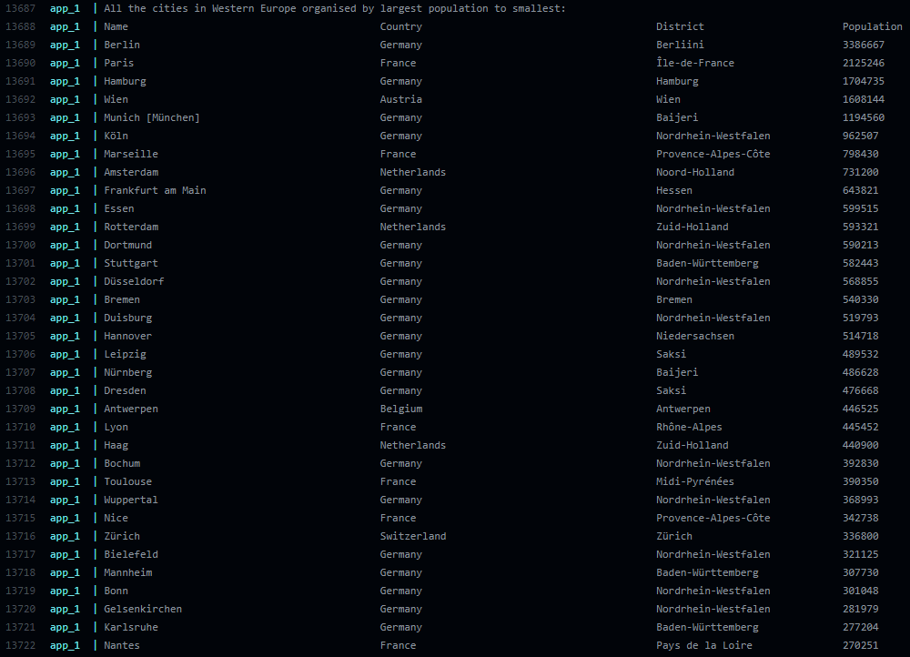  |
| [All the cities in a country organised by largest population to smallest (United Kingdom)](https://github.com/scottlangmead/SET08103-G11/issues/10)          | 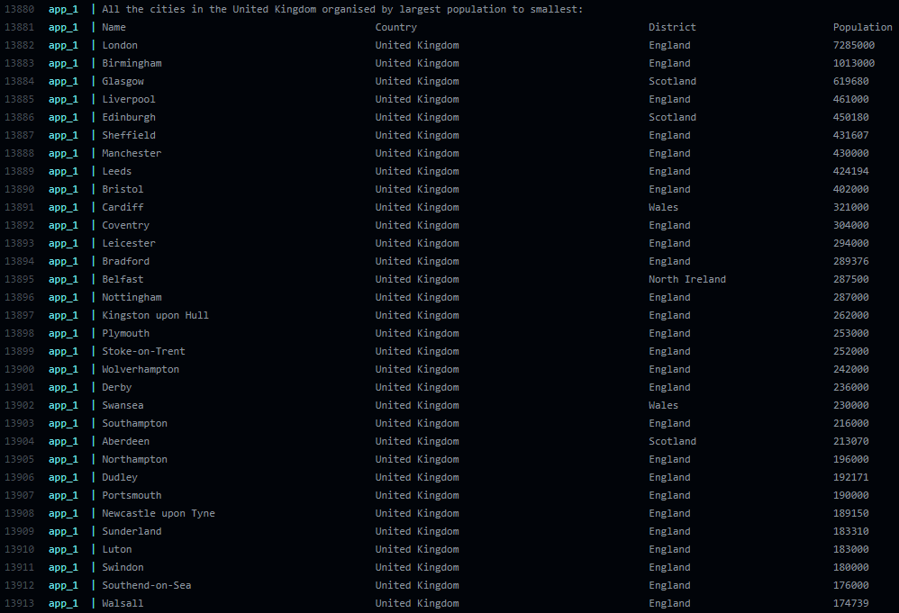 |
| [All the cities in a district organised by largest population to smallest (Scotland)](https://github.com/scottlangmead/SET08103-G11/issues/11)               | 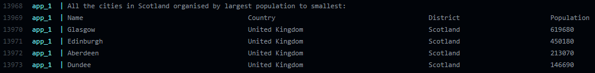 |
| [The top N populated cities in the world where N is provided by the user](https://github.com/scottlangmead/SET08103-G11/issues/12)                           | 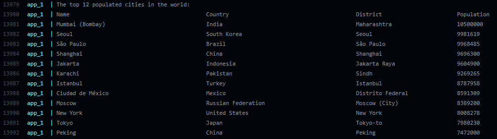 |
| [The top N populated cities in a continent where N is provided by the user (South America)](https://github.com/scottlangmead/SET08103-G11/issues/13)         | 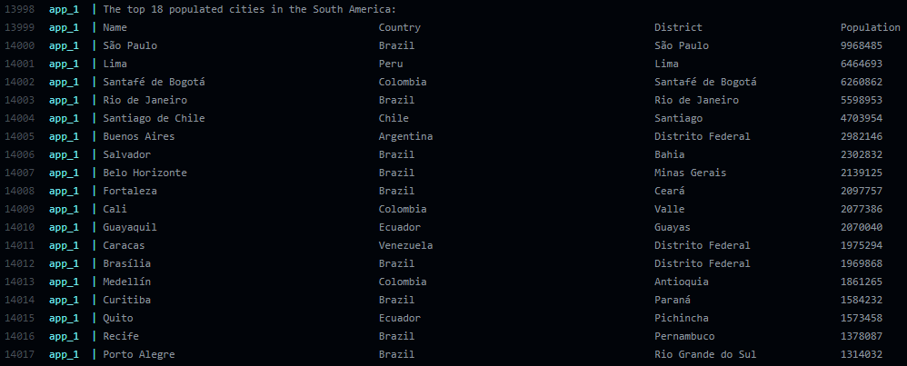 |
| [The top N populated cities in a region where N is provided by the user (Central Africa)](https://github.com/scottlangmead/SET08103-G11/issues/14)           | 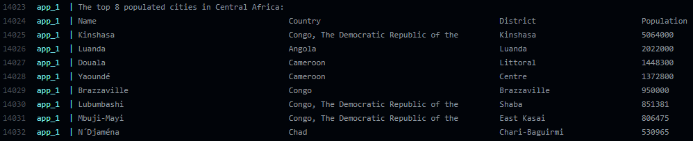 |
| [The top N populated cities in a country where N is provided by the user (Russian Federation)](https://github.com/scottlangmead/SET08103-G11/issues/15)      | 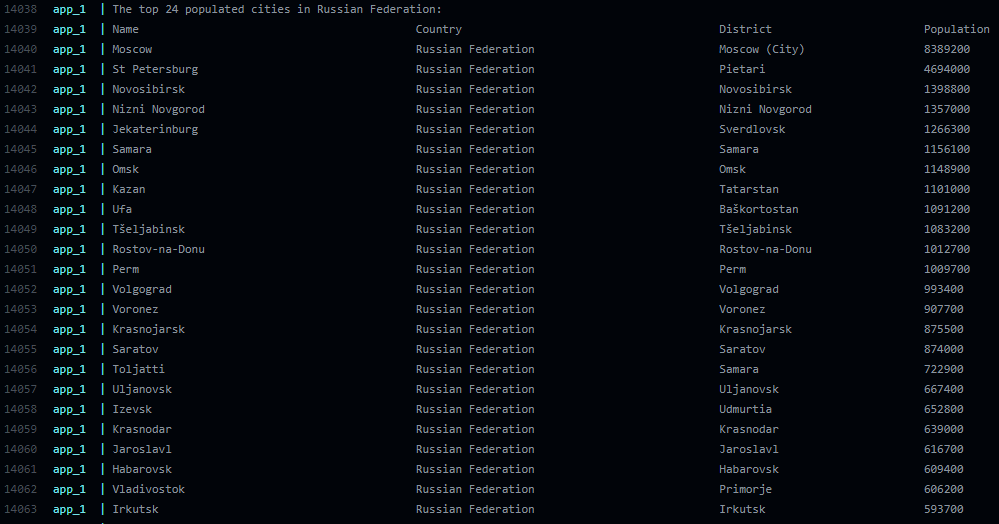 |
| [The top N populated cities in a district where N is provided by the user (California)](https://github.com/scottlangmead/SET08103-G11/issues/16)             | 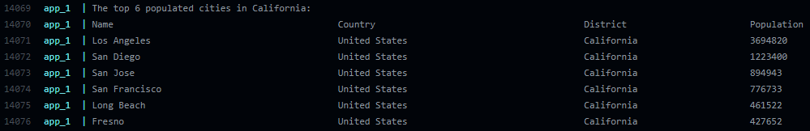 |
| [All the capital cities in the world organised by largest population to smallest](https://github.com/scottlangmead/SET08103-G11/issues/17)                   | 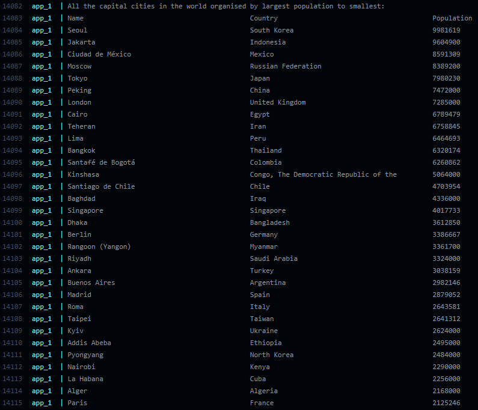 |
| [All the capital cities in a continent organised by largest population to smallest (Europe)](https://github.com/scottlangmead/SET08103-G11/issues/18)        | 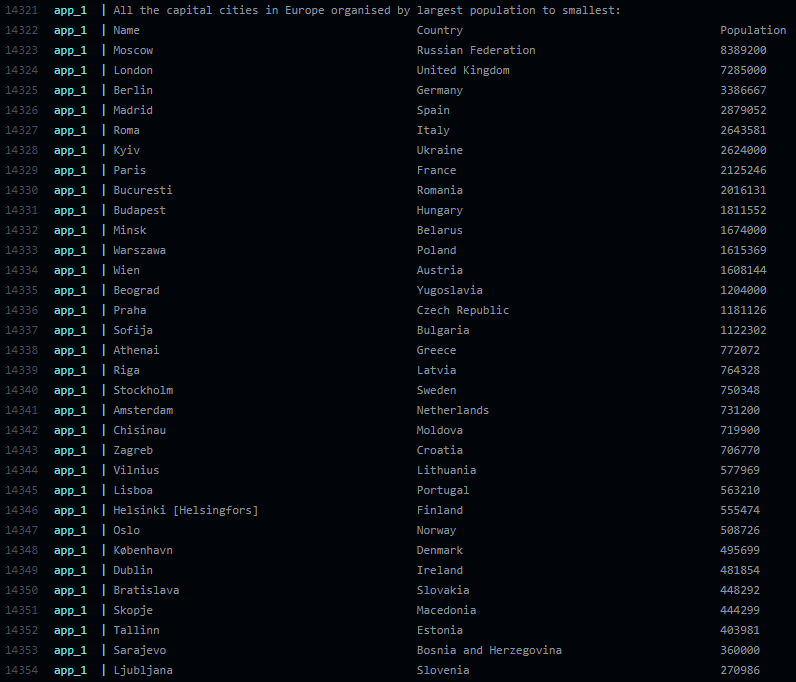 |
| [All the capital cities in a region organised by largest to smallest (Eastern Europe)](https://github.com/scottlangmead/SET08103-G11/issues/19)              | 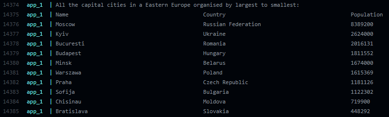 |
| [The top N populated capital cities in the world where N is provided by the user](https://github.com/scottlangmead/SET08103-G11/issues/20)                   | 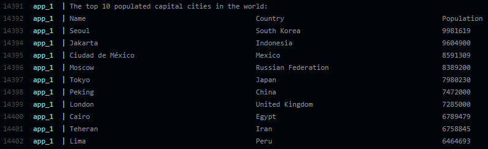 |
| [The top N populated capital cities in a continent where N is provided by the user (South America)](https://github.com/scottlangmead/SET08103-G11/issues/21) | 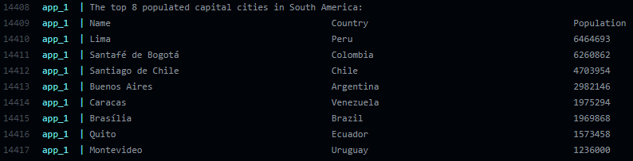 |
| [The top N populated capital cities in a region where N is provided by the user (Middle East)](https://github.com/scottlangmead/SET08103-G11/issues/22)      | 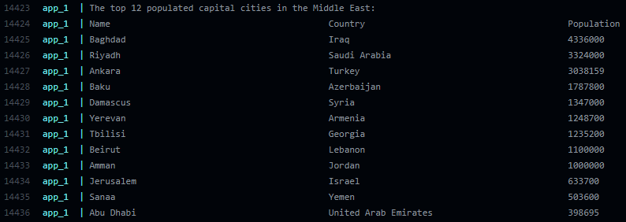 |